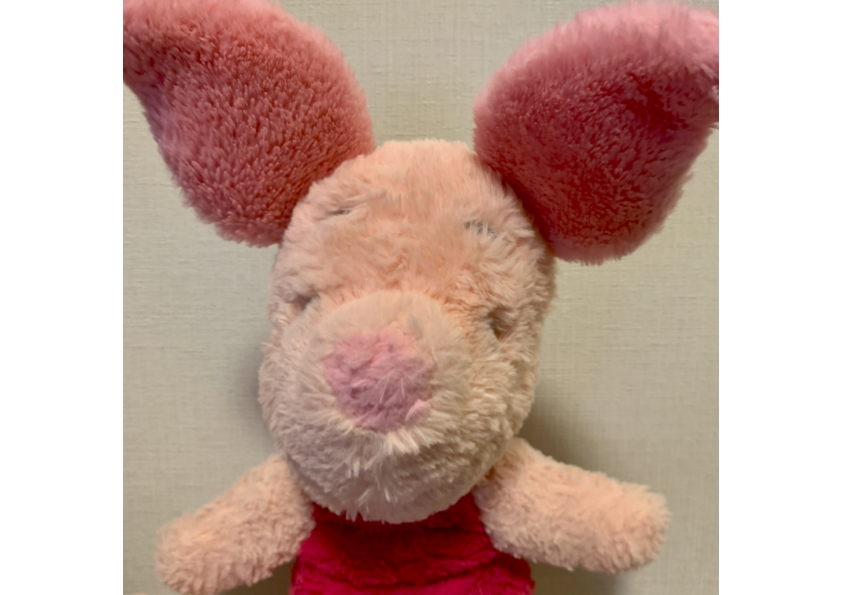
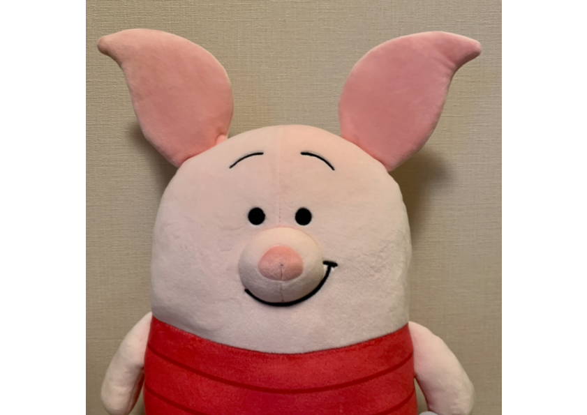
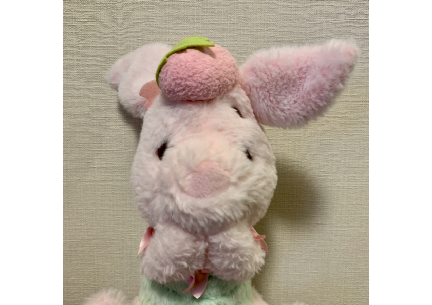
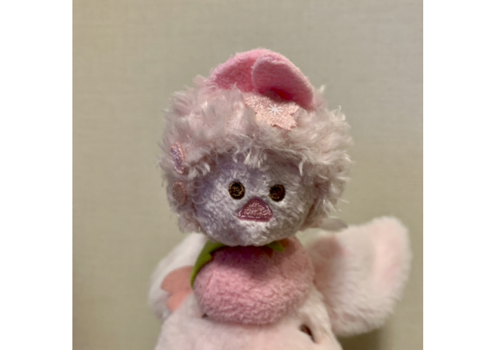
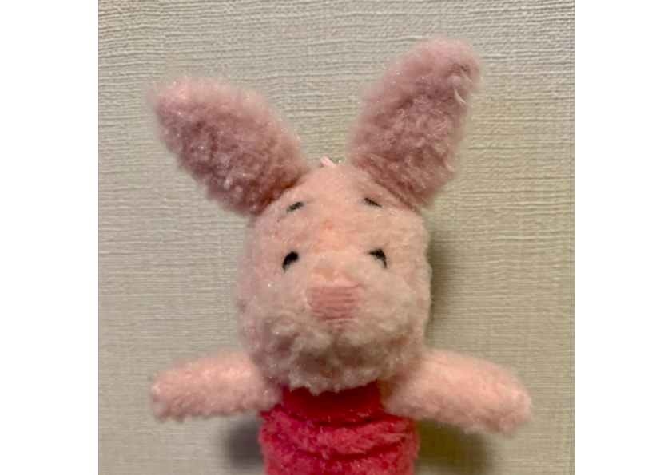

# カラフルスコップ研究室のメンバー

  

    

      
    

    

      

        
ぶーちゃん

        
カラフルスコップ研究室主任研究員。思いやりがあってやさしく、面倒見もいい。

      

    

  

  

    

      
    

    

      

        
でぶーちゃん

        
カラフルスコップ研究室長。みんなの先生。博学だが動きはゆっくり。

      

    

  

  

    

      
    

    

      

        
ちびぶーちゃん

        
カラフルスコップ研究室研究員。心配性だが好奇心旺盛でぶーちゃんを尊敬している。

      

    

  

  

    

      
    

    

      

        
ちびちびぶーちゃん

        
カラフルスコップ研究室の事務員さん。みんなが研究できるように優しく見守っている。

      

    

  

  

    

      
    

    

      

        
みにぶーちゃん

        
カラフルスコップ大学の学生。週に2回研究にやってくる。動きがはやい。

      

    

  

メンバー募集中！